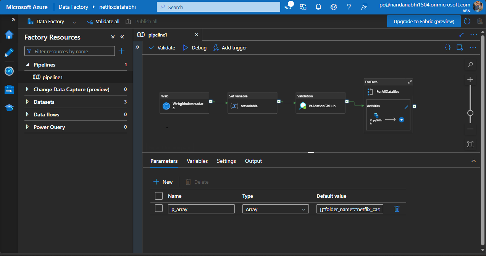

# Azure Data Factory Pipeline

## Project Overview

Azure Data Factory (ADF) is used to retrieve Netflix dataset files from GitHub and copy them into Azure Data Lake Storage for further processing in Azure Databricks.

## Pipeline Workflow

GitHub → Web Activity → Set Variable → Validation → ForEach → Copy Data → ADLS Raw

## Pipeline Activities

### 1. Web Activity

Retrieves metadata from the GitHub source.

### 2. Set Variable Activity

Stores the required pipeline information for further processing.

### 3. Validation Activity

Validates the GitHub data files before the copy operation.

### 4. ForEach Activity

The ForEach activity processes the files listed in the `p_array` pipeline parameter.

Expression:

`@pipeline().parameters.p_array`

### 5. Copy Data Activity

Copies the selected files from GitHub into the Raw container in Azure Data Lake Storage.

## Dynamic Parameterization

The source dataset uses the current file name:

`@item().file_name`

The sink dataset uses the current folder and file name:

`@item().folder_name`

`@item().file_name`

This allows the pipeline to process multiple files using dynamic dataset parameters.

## Destination

The ingested data is stored in the Raw container of Azure Data Lake Storage.

The data is then used for further processing in Azure Databricks.

## Technologies Used

- Azure Data Factory
- GitHub
- Azure Data Lake Storage
- Azure Databricks

## Pipeline Screenshot

